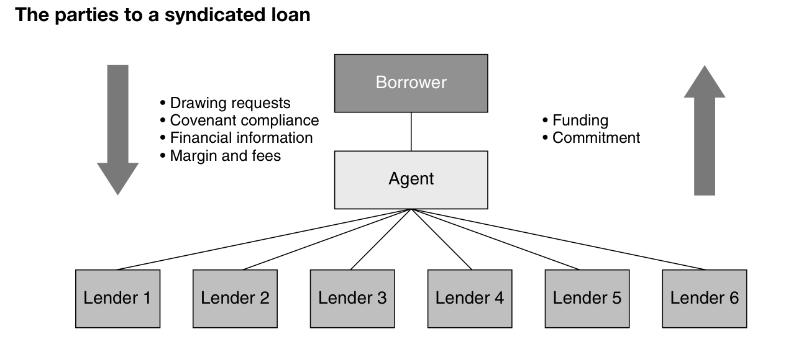
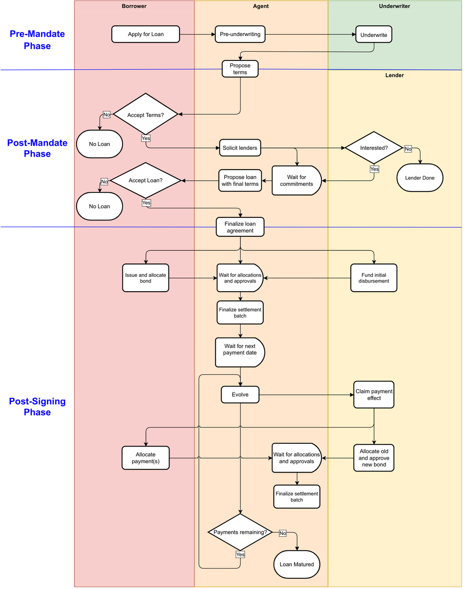

# Syndicated Lending in DAML

* [Project Description](#project-description)
  * [Phases](#phases)
  * [Parties](#parties)
  * [Workflows](#workflows)
  * [Future Directions](#future-directions)
  * [References](#references)
* [Building the Project](#building-the-project)

## Project Description
This is application has been built by [Obsidian Systems](https://obsidian.systems) as an example of how [DAML](https://www.daml.com/) can be used to model syndicated lending.

A syndicated loan is a loan that is issued by multiple parties, called participants, via an intermediary, called an agent or arranger, to a borrower. Within that basic structure there are many, many possible variations.

### Phases

> There are three principal phases to a syndicated transaction. The first is the pre-mandate phase during which the details of the proposed transaction are pitched, discussed and finalised. This pre-mandate phase is rarely shorter than one month and can be as long as one year depending on factors such as transaction complexity, market conditions and borrower sentiment. The second phase is the post-mandate phase during which the syndication itself takes place, and the facility agreements along with associated documentation are negotiated. It is concluded by the signing of the agreements and associated documentation, and sometimes a closing ceremony. This phase is usually completed in a period of six to eight weeks. The third and final phase is the post-signing phase, which lasts for the life of the facility itself and is rarely shorter than six months (in the case of a bridge loan for example) or longer than five years for standard syndicated transactions, although syndicated transactions on some aircraft and project financings have been contracted for a period of up to 18 years.

-- [*Syndicated Lending: Practice and Documentation*](https://financialmarketstoolkit.cliffordchance.com/en/financial-markets-resources/resources-by-type/guides/syndicated-lending-7th-edition--december-2019-.html)

### Parties

A basic syndicated loan involves the following primary parties:

* a single borrower who requests a loan from an agent;
* an agent (also called an arranger) who collects the borrowers information, underwrites the loan, and then proposes it (without the borrowers personal information) to a group of participant lenders;
* participants, who review the agent's proposals and offer loans for set sums and interest rates to satisfy part of the loan request.

### Workflows

This application models loan origination and servicing.

### Future Directions

This example can be extended in a number of ways, including:

* Adding agent fees
* Modeling covenants and loan modifications/acceleration on covenant breach
* Modeling interest rate modifications (either due to variable rate or as a consequence of contractual terms)

### References

- [Syndicated Lending: Practice and Documentation](https://financialmarketstoolkit.cliffordchance.com/en/financial-markets-resources/resources-by-type/guides/syndicated-lending-7th-edition--december-2019-.html)
- [Syndicated Lending (Essential Capital Markets)](https://www.elsevier.com/books/syndicated-lending/fight/978-0-7506-5907-9)

## Building the Project

If you're a [Nix](https://nixos.org/) user, you can use `nix-shell` to enter a shell with all the required dependencies. Otherwise, install the daml sdk by following the directions [here](https://docs.daml.com/getting-started/installation.html).

Once you have the sdk, you can run:

* `daml studio` to open the project and run the scripts
* `daml test` to run the test scripts
* `daml build` to compile dar packages for deployment

